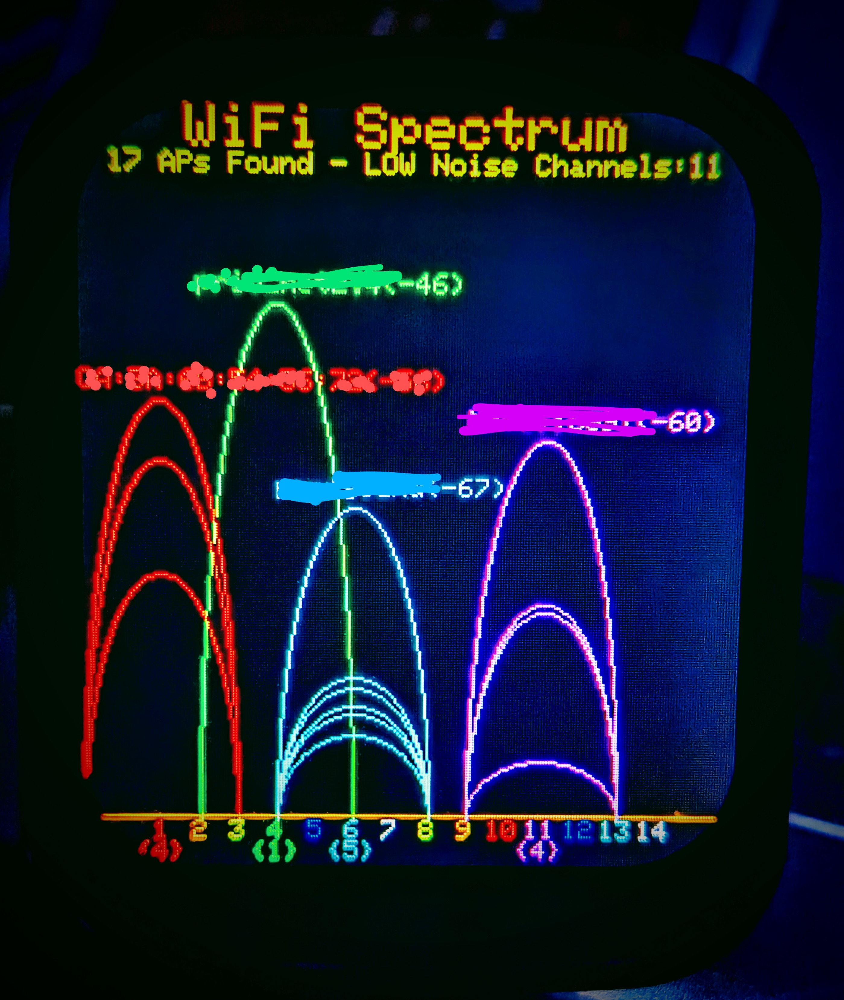

# Waveshare ESP32-S3 Touch LCD 1.69 Project

This repository contains updated code examples with the Waveshare ESP32-S3 Touch LCD 1.69 to implement a WiFi Spectrum Analyzer.

### Changes

* *Adjusted the text sizes and titles*
* *Adjusted found access point line to correctly space & show the # of APs with curved corners*
* *Adjusted colors : title, upper banner, and graph colors*





## Hardware Overview

The Waveshare ESP32-S3 Touch LCD 1.69 is a microcontroller development board based on the ESP32-S3. It features:

* An ESP32-S3 N8R2 module (8MB PSRAM, 2MB Flash)
* A 1.69-inch IPS LCD screen (240x280 resolution, ST7789V driver)
* Capacitive touch panel (CST816S controller)
* Onboard peripherals (e.g., accelerometer, RTC, battery charging circuit - *verify based on your specific board version*)

## Basic Usage

1.  **Environment Setup:**
    * Install the Arduino IDE or configure your preferred development environment (e.g., PlatformIO).
    * Add ESP32 board support to your IDE. Follow the official Espressif instructions for the [Arduino IDE](https://docs.espressif.com/projects/arduino-esp32/en/latest/installing.html) or PlatformIO.
    * Install necessary libraries. Refer to the specific code examples and the official Waveshare Wiki for required libraries (e.g., `TFT_eSPI`, libraries for the touch controller and other peripherals).

2.  **Clone Repository:**
    ```bash
    git clone <your-repository-url>
    cd <your-repository-directory>
    ```

3.  **Compile & Upload:**
    * Open an example sketch (`.ino` file) in your IDE.
    * Select the appropriate ESP32 board (often a generic "ESP32S3 Dev Module" works, but check Waveshare's documentation for specific recommendations). Configure settings like PSRAM (Enable OPI PSRAM), Flash Size, etc., if necessary.
    * Select the correct COM port for your connected device.
    * Compile and upload the sketch to the board.

## Resources

* **Official Waveshare Wiki:** For detailed documentation, schematics, and original example code:
    [Waveshare ESP32-S3 Touch LCD 1.69 Wiki](https://www.waveshare.com/wiki/ESP32-S3-Touch-LCD-1.69)


